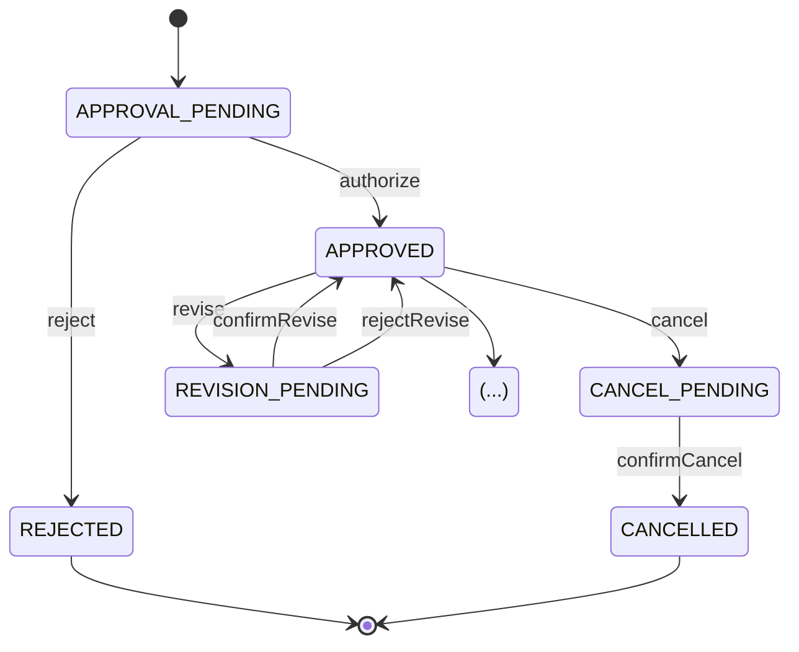

ftgo-order-service-api
===

```mermaid
stateDiagram-v2
    [*] --> APPROVAL_PENDING
    
    APPROVAL_PENDING --> APPROVED : authorize
    APPROVAL_PENDING --> REJECTED : reject

    APPROVED --> CANCEL_PENDING : cancel
    APPROVED --> REVISION_PENDING : revise
    APPROVED --> (...)

    REJECTED --> [*]

    CANCEL_PENDING --> CANCELLED : confirmCancel
    CANCELLED --> [*]

    REVISION_PENDING --> APPROVED : confirmRevise
    REVISION_PENDING --> APPROVED : rejectRevise
```
